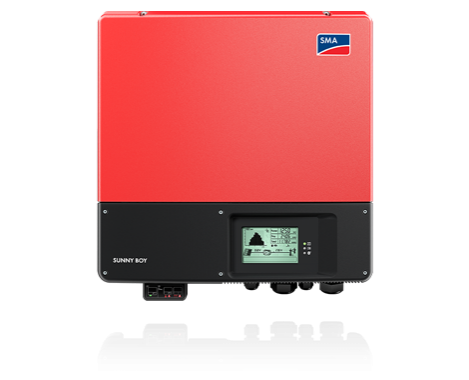
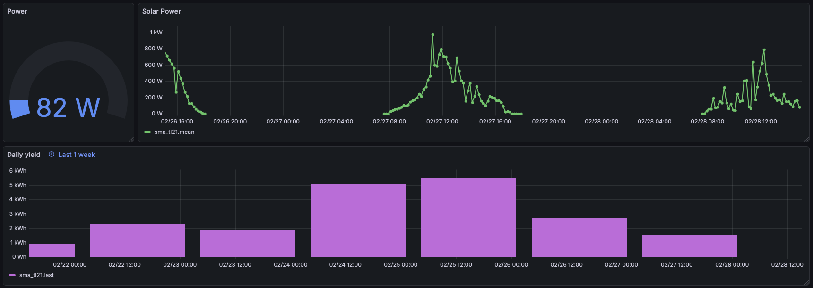

# SMA-SunnyBoy-Poll

Python script to poll SMA Sunny Boy inverters using ModBus.
Data is stored in an Influx 1.7 database, for visualisation with Grafana.



## Contents
* [Prerecquisites](#prerecquisites)
* [Installation Steps](#installation-steps)
* [Usage](#usage)
* [Links](#links)


## Prerecquisites
1. For this library you need python3
2. For the use of this python code it is necessary to install the python libs:
    - `pymodbus`
    - `influxdb`
> Remark: `pymodbus` is tested with version 3.12.0, `influxdb` is tested with version 5.3.2, for InfluxDB 1.7

### Make python ready to use
1) Create a python3 virtual environment, for raspberry pi, see:<br>
[https://www.raspberrypi.com/documentation/computers/os.html#use-pip-with-virtual-environments](https://www.raspberrypi.com/documentation/computers/os.html#use-pip-with-virtual-environments)

```
python -m venv mypythonenv
source mypythonenv/bin/activate
```
2. Install the needed python packages

> more information on pymodbus can be found here:<br>
[https://pymodbus.readthedocs.io/en/](https://pymodbus.readthedocs.io/en/)

```
pip install pymodbus
pip install influxdb
```
You can check the state by:

```
python -m pip list
```

### Make your SMA Inverter ready to use
1. make sure that your SMA Device supports the modbus protocol.
2. make sure that the SMA Device has started/enabled the TCP Server to communicate via modbus.

## Installation
Install sma_poll from github.<br>

```
mkdir mypythonenv
cd mypythonenv
git clone https://github.com/Agrivision/SMA-SunnyBoy-Poll.git
```

### Change IP and UnitID
Check the python code in the script `sma_poll.py` and change the settings if necessary.<br>
Especially the `ip-address` has to be adapted to your settings in the following line:

```
INVERTER_IP = "192.168.xxx.xxx"
```
The device UnitID has the value  `3` as default.<br>

Check the path names in log_solar.sh and addapt them accordingly.

## Usage

### Add call to this script to crontab

Several options exists to poll the Sunny Boy modbus. Telegraf is one of them, and widely used.
Here we use crontab which already is installed by default on a raspberry pi.
For a slow process like solar panel logging it works perfectly fine. Poll interval is 10 minutes, but can adapted to ones own wishes. 

```
# solar inveerter logger
5,15,25,35,45,55 * * * *      /home/pi/log_solar.sh >> /var/log/sma_poll.log 2>&1
```

### Grafana

In Grafana now a dashbourd can be made that queries the InfluxDB solar database.

```
SELECT mean("ac_power") FROM "sma_tl21" WHERE $timeFilter GROUP BY time($__interval) fill(null)
```

Here is an example dashboard, showing current power and daily yield.



That's it!

## Links

* [More Info on the project at my website agri-vision.nl](https://www.agri-vision.nl)